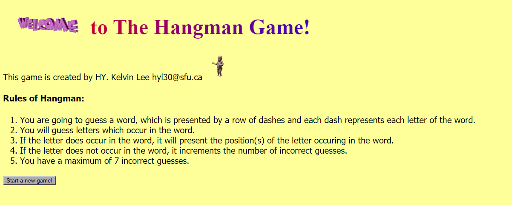
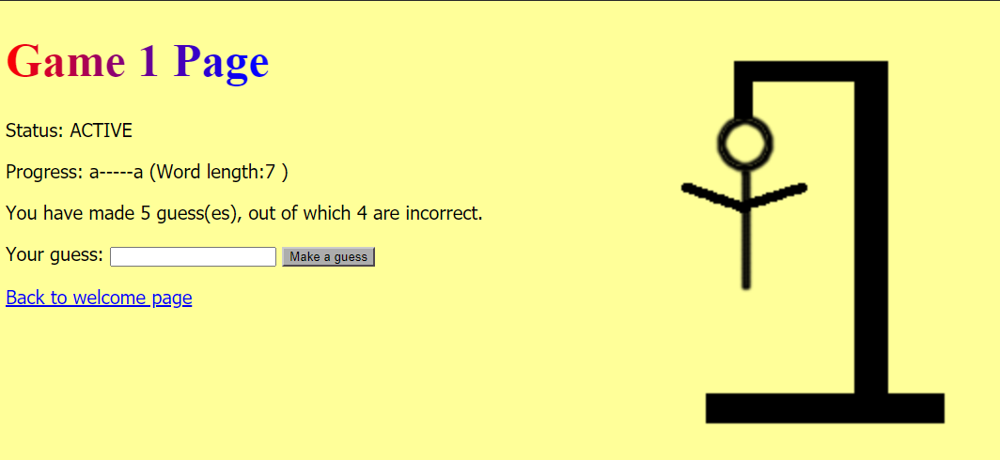
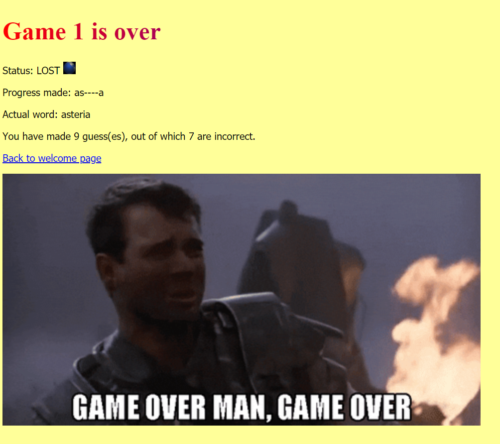

# HangmanJava
A HTML-Based Hangman Game written in Java with Spring Boot and Thymeleaf framework.
## Getting Started
### Prerequisites
This application is developed in IntelliJ IDEA Community Edition 2020.1.1. It has been built and tested working in that specific version of IntelliJ.
## Screenshots

